# Variable Selection via Net Benefit with NBvarsel

## 1 Introduction

Traditional variable selection methods (e.g., backward elimination,
LASSO) optimise statistical performance metrics such as AUC or deviance.
However, the best-performing model in statistical terms does not
necessarily yield the best clinical utility when predictor costs (test
harms) are accounted for. The `NBvarsel` package implements a variable
selection framework based on cross-validated **Net Benefit**, the
standard metric for clinical utility in decision curve analysis.

The core function
[`nb_varsel()`](https://lasaibarrenada.github.io/NB_varsel/reference/nb_varsel.md)
evaluates predictor subsets by their contribution to clinical
decision-making, optionally adjusted for test harms. It supports:

- **Exhaustive** and **groupwise** (backward elimination) search
  strategies
- Predictor costs (per-variable or grouped)
- Restricted cubic splines for continuous predictors
- Interaction terms
- Permutation importance scores
- Parallel computation

## 2 Simple illustration

> **Reproducible section**
>
> This section is fully reproducible as the data generation is included
> in the code.

Let us consider a hypothetical scenario with four predictors, two
continuous ($X_{1}$, $X_{3}$) and two binary ($X_{2}$, $X_{4}$), used to
predict a binary outcome $Y$. The true data-generating model is:

$$\text{logit}(Y) = -3 + 3X_{1} + 2X_{2} + 0.1X_{3} - 0.05X_{4}\qquad(1)$$

In this model, $X_{1}$ and $X_{2}$ are strongly predictive, $X_{3}$ and
$X_{4}$ are weakly predictive, and the outcome has a prevalence of
approximately 64%. Each predictor is associated with a test harm:
$X_{1}$ and $X_{3}$ (harm = 0.05), $X_{2}$ (harm = 0.025), and $X_{4}$
(harm = 0.00005).

### 2.1 Data generation

Code

``` r
set.seed(42)
n <- 1000

X1 <- rnorm(n, mean = 0, sd = 1)
X2 <- rbinom(n, size = 1, prob = 0.7)
X3 <- rnorm(n, mean = 0, sd = 1)
X4 <- rbinom(n, size = 1, prob = 0.5)

log_odds <- -3 + 3 * X1 + 2 * X2 + 0.1 * X3 - 0.05 * X4
prob <- plogis(log_odds)
Y <- rbinom(n, size = 1, prob = prob)

df <- data.frame(X1 = X1, X2 = X2, X3 = X3, X4 = X4, Y = Y)

harms <- c(X1 = 0.05, X2 = 0.025, X3 = 0.05, X4 = 0.00005)
```

### 2.2 Backward elimination (baseline)

Using backward elimination based on Wald’s statistic, as implemented in
`fastbw()` of the `rms` package:

Code

``` r
model_full <- lrm(Y ~ X1 + X2 + X3 + X4, data = df)
bw_result <- fastbw(model_full)
sprintf("Backward elimination retains: %s", paste(bw_result$names.kept, collapse = ", "))
```

    [1] "Backward elimination retains: X1, X2"

### 2.3 Exhaustive net benefit variable selection

Code

``` r
exhaustive <- nb_varsel(
  data = df,
  outcome_var = "Y",
  include_interactions = FALSE,
  costs = harms,
  cv_folds = 5,
  mode = "exhaustive",
  thresholds = 0.5,
  allow_parallel = FALSE,
  permutation = TRUE,
  splines = FALSE,
  n_knots = 3,
  verbose = FALSE
)
```

### 2.4 Results

Code

``` r
tbl_train <- exhaustive$all_models

tbl_train |>
  select(Model, AUC, Brier, Total_Cost, Avg_Adj_Net_Benefit, Avg_Net_Benefit) |>
  arrange(-Avg_Adj_Net_Benefit) |>
  gt(id = "tb-train") |>
  fmt_number(
    columns = c("AUC", "Brier", "Avg_Adj_Net_Benefit", "Avg_Net_Benefit"),
    decimals = 3
  ) |>
  cols_label(
    Model = "Included predictors",
    AUC = "AUC",
    Brier = "Brier Score",
    Avg_Net_Benefit = "Avg. Net Benefit",
    Total_Cost = "Total Cost",
    Avg_Adj_Net_Benefit = "Avg. Adj. Net Benefit"
  )
```

| Included predictors | AUC   | Brier Score | Total Cost | Avg. Adj. Net Benefit | Avg. Net Benefit |
|---------------------|-------|-------------|------------|-----------------------|------------------|
| X1, X4              | 0.906 | 0.115       | 0.05005    | 0.104                 | 0.154            |
| X1                  | 0.907 | 0.114       | 0.05000    | 0.102                 | 0.152            |
| X1, X2              | 0.925 | 0.102       | 0.07500    | 0.099                 | 0.174            |
| X1, X2, X4          | 0.925 | 0.102       | 0.07505    | 0.099                 | 0.174            |
| X1, X3              | 0.906 | 0.114       | 0.10000    | 0.056                 | 0.156            |
| X1, X3, X4          | 0.906 | 0.114       | 0.10005    | 0.055                 | 0.155            |
| X1, X2, X3, X4      | 0.925 | 0.102       | 0.12505    | 0.049                 | 0.174            |
| X1, X2, X3          | 0.925 | 0.101       | 0.12500    | 0.048                 | 0.173            |
| X4                  | 0.521 | 0.217       | 0.00005    | 0.000                 | 0.000            |
| X2                  | 0.589 | 0.210       | 0.02500    | −0.025                | 0.000            |
| X2, X4              | 0.571 | 0.211       | 0.02505    | −0.025                | 0.000            |
| X3                  | 0.532 | 0.217       | 0.05000    | −0.050                | 0.000            |
| X3, X4              | 0.520 | 0.217       | 0.05005    | −0.050                | 0.000            |
| X2, X3              | 0.607 | 0.210       | 0.07500    | −0.075                | 0.000            |
| X2, X3, X4          | 0.593 | 0.211       | 0.07505    | −0.075                | 0.000            |

Table 1: Results for the simple illustration. Models are ranked by
cost-adjusted Net Benefit.

The variable importance of each feature is shown in
[Figure 1](#fig-simple-illustration-1), illustrating the main
contributors to utility. In [Figure 2](#fig-simple-illustration-2), the
all-subset plot shows the evolution of the average adjusted Net Benefit
across all possible combinations. It is immediately apparent that
including $X_{1}$ improves performance. This simple illustration
demonstrates how the best subset of predictors in statistical terms does
not necessarily translate to better cost-utility.

Code

``` r
VIF_plot(tbl_train) +
  theme(axis.text.x = element_text(angle = 0, hjust = 1))

all_subset_plot(
  tbl_train,
  filter = 100,
  metric = "Avg_Adj_Net_Benefit",
  y_axis = "Adjusted Net Benefit"
)
```

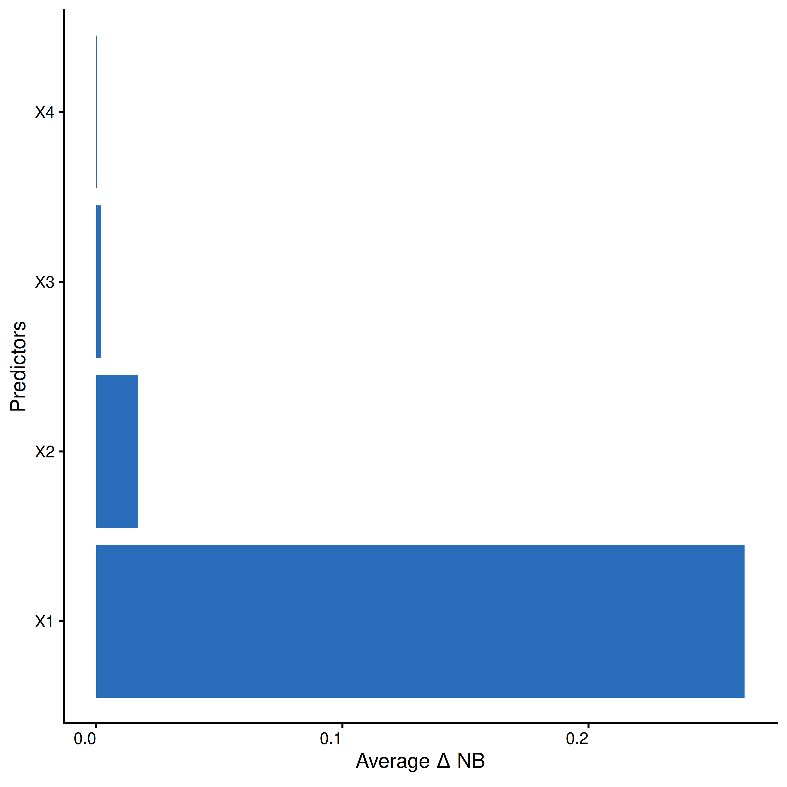

Figure 1: Net benefit based variable importance for the simple
illustration.

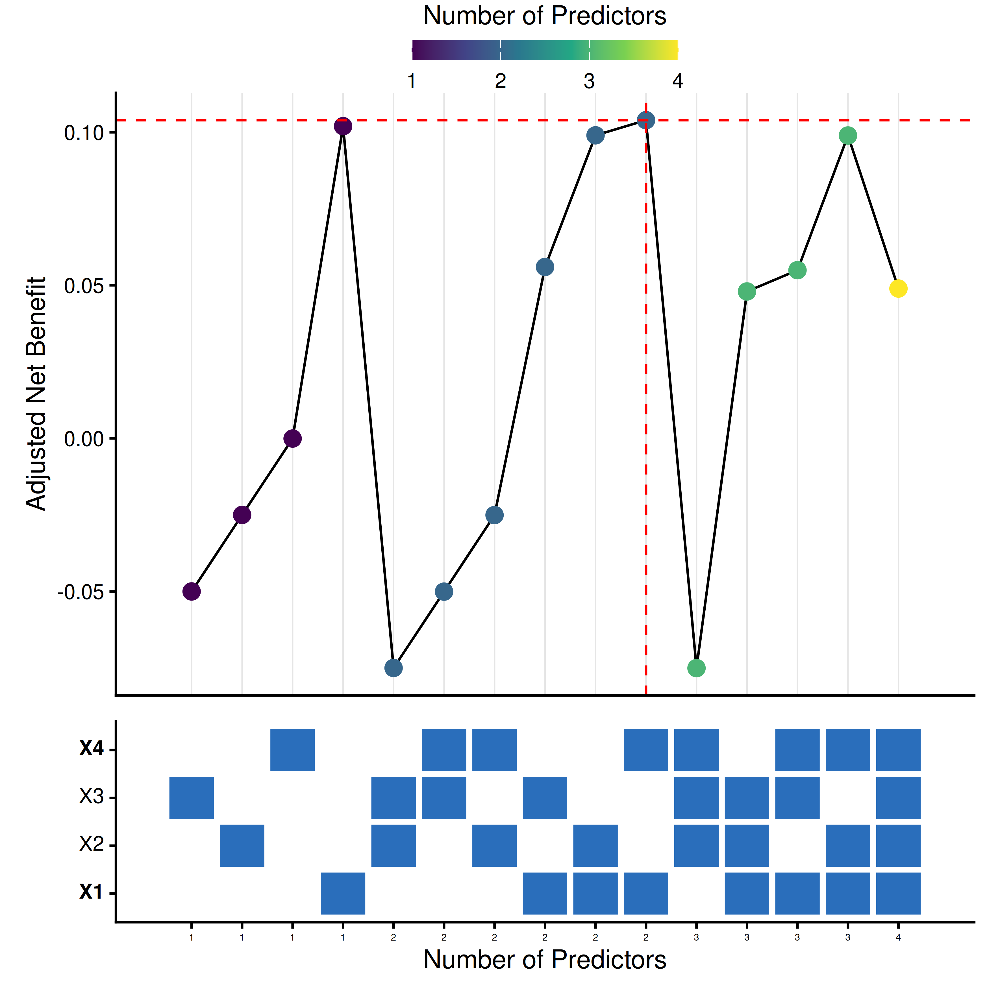

Figure 2: All subset plot for the simple illustration.

## 3 Case study — fabricated clinical data

> **Reproducible section**
>
> This section uses fabricated data designed to resemble a clinical
> prediction setting. All data generation code is included.

We now demonstrate the methodology on a more realistic scenario. We
simulate a dataset mimicking a heart failure readmission prediction
setting with 10 predictors and a binary outcome (readmitted within 30
days vs. not). Predictors are grouped into three cost categories:

- **Clinical history** (no cost): patient age, prior admission,
  specialist centre, symptom severity
- **Cardiac imaging** (moderate cost): ejection fraction, wall thickness
  ratio, valve abnormalities, pericardial effusion, chamber dilation
- **Blood biomarker** (higher cost): NT-proBNP

### 3.1 Data generation

Code

``` r
# Clean up simple illustration objects to avoid namespace conflicts
rm(list = setdiff(ls(), lsf.str()))

set.seed(8156)
n_train <- 3000
n_test <- 1500
n_total <- n_train + n_test

# Clinical history (free)
patient_age <- round(rnorm(n_total, mean = 68, sd = 12))
prior_admission <- rbinom(n_total, 1, 0.30)
specialist_centre <- rbinom(n_total, 1, 0.45)
symptom_severity <- rbinom(n_total, 1, 0.40)

# Cardiac imaging (moderate cost)
ejection_fraction <- pmin(75, pmax(10, rnorm(n_total, 42, 14)))
wall_thickness <- pmin(1, pmax(0.05, rbeta(n_total, 2, 4)))
valve_abnormalities <- rpois(n_total, lambda = 0.8)
pericardial_effusion <- rbinom(n_total, 1, 0.12)
chamber_dilation <- rbinom(n_total, 1, 0.22)

# Blood biomarker (higher cost)
nt_probnp <- round(pmax(20, rlnorm(n_total, meanlog = 6.5, sdlog = 1.4)))

# True model — strong signal for key predictors
lp <- -16.0 +
  0.07 * patient_age +
  3.0 * prior_admission +
  -0.12 * ejection_fraction +
  10.0 * wall_thickness +
  1.5 * valve_abnormalities +
  2.5 * pericardial_effusion +
  1.8 * chamber_dilation +
  0.9 * log2(nt_probnp) +
  # Weak / null predictors:
  0.03 * specialist_centre +
  0.02 * symptom_severity

readmitted <- rbinom(n_total, 1, plogis(lp))

clinical_df <- data.frame(
  readmitted, patient_age, nt_probnp, prior_admission,
  specialist_centre, ejection_fraction, valve_abnormalities,
  pericardial_effusion, chamber_dilation, symptom_severity,
  wall_thickness
)

training_data <- clinical_df[1:n_train, ]
test_data <- clinical_df[(n_train + 1):n_total, ]

sprintf("Training prevalence: %.1f%%", 100 * mean(training_data$readmitted))
```

    [1] "Training prevalence: 34.5%"

Code

``` r
sprintf("Test prevalence: %.1f%%", 100 * mean(test_data$readmitted))
```

    [1] "Test prevalence: 35.8%"

### 3.2 Cost structure

Costs are defined as grouped costs. The group cost is added once if
*any* predictor from that group is included in the model.

Code

``` r
prevalence <- mean(test_data$readmitted)

grouped_costs <- list(
  history = list(
    cost = 0,
    vars = c("patient_age", "prior_admission", "specialist_centre",
             "symptom_severity")
  ),
  imaging = list(
    cost = prevalence * 0.03,
    vars = c(
      "ejection_fraction", "wall_thickness",
      "valve_abnormalities", "pericardial_effusion", "chamber_dilation"
    )
  ),
  biomarker = list(
    cost = prevalence * 0.08,
    vars = c("nt_probnp")
  )
)
```

### 3.3 Exhaustive net benefit variable selection

Code

``` r
vars <- names(training_data)

start_time <- Sys.time()
exhaustive_results <- nb_varsel(
  data = training_data,
  outcome_var = "readmitted",
  costs = grouped_costs,
  thresholds = seq(0.01, 0.2, by = 0.01),
  include_interactions = FALSE,
  cv_folds = 5,
  mode = "exhaustive",
  allow_parallel = TRUE,
  permutation = TRUE,
  splines = FALSE,
  verbose = FALSE
)
end_time <- Sys.time()

sprintf("Exhaustive search took: %s", format(end_time - start_time))
```

    [1] "Exhaustive search took: 4.265587 mins"

#### 3.3.1 Best model

Code

``` r
exhaustive_results$best_model_stats |>
  select(Model, AUC, Brier, Total_Cost, Avg_Adj_Net_Benefit, Avg_Net_Benefit) |>
  gt() |>
  fmt_number(
    columns = c("AUC", "Brier", "Total_Cost", "Avg_Adj_Net_Benefit", "Avg_Net_Benefit"),
    decimals = 3
  ) |>
  cols_label(
    Model = "Included predictors",
    AUC = "AUC",
    Brier = "Brier Score",
    Avg_Net_Benefit = "Avg. Net Benefit",
    Total_Cost = "Total Cost",
    Avg_Adj_Net_Benefit = "Avg. Adj. Net Benefit"
  )
```

| Included predictors                                                                                                          | AUC   | Brier Score | Total Cost | Avg. Adj. Net Benefit | Avg. Net Benefit |
|------------------------------------------------------------------------------------------------------------------------------|-------|-------------|------------|-----------------------|------------------|
| patient_age, prior_admission, ejection_fraction, valve_abnormalities, pericardial_effusion, chamber_dilation, wall_thickness | 0.896 | 0.122       | 0.011      | 0.285                 | 0.296            |

Table 2: Best model from exhaustive search

#### 3.3.2 All models

Code

``` r
all_models <- exhaustive_results$all_models
all_models$Rank_NB <- rank(-all_models$Avg_Net_Benefit, ties.method = "min")
all_models$Rank_adj_NB <- rank(-all_models$Avg_Adj_Net_Benefit, ties.method = "min")

tbl_data <- all_models |>
  select(
    Rank_NB, Rank_adj_NB, Model, AUC, Brier,
    Total_Cost, Avg_Adj_Net_Benefit, Avg_Net_Benefit
  )

tbl <- tbl_data |>
  gt() |>
  fmt_number(
    columns = c("AUC", "Brier", "Total_Cost", "Avg_Adj_Net_Benefit", "Avg_Net_Benefit"),
    decimals = 3
  ) |>
  cols_label(
    Rank_NB = "Rank (NB)",
    Rank_adj_NB = "Rank (Adj. NB)",
    Model = "Included predictors",
    AUC = "AUC",
    Brier = "Brier Score",
    Avg_Net_Benefit = "Avg. NB",
    Total_Cost = "Total Cost",
    Avg_Adj_Net_Benefit = "Avg. Adj. NB"
  )

if (knitr::is_html_output()) {
  tbl <- tbl |>
    opt_interactive(
      use_pagination = TRUE,
      page_size_default = 10,
      use_filters = TRUE,
      use_compact_mode = TRUE
    )
}
tbl
```

Table 3: All models from exhaustive search

#### 3.3.3 Visualisation

Code

``` r
VIF_plot(
  exhaustive_results$all_models,
  filter = round(nrow(exhaustive_results$all_models) * 0.1)
)
```

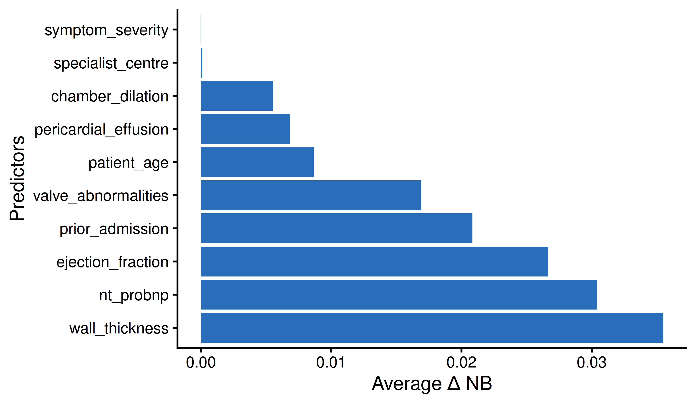

Figure 3: Variable importance plot (exhaustive search)

[Figure 3](#fig-case-vif) shows the variable importance based on the
average Net Benefit contribution. Predictors are ranked from most to
least important.

Code

``` r
all_subset_plot(
  exhaustive_results$all_models,
  filter = 7,
  size_dot = 1
)

all_subset_plot(
  exhaustive_results$all_models,
  filter = 7,
  size_dot = 1,
  metric = "Avg_Adj_Net_Benefit",
  y_axis = "Adjusted Net Benefit"
)
```

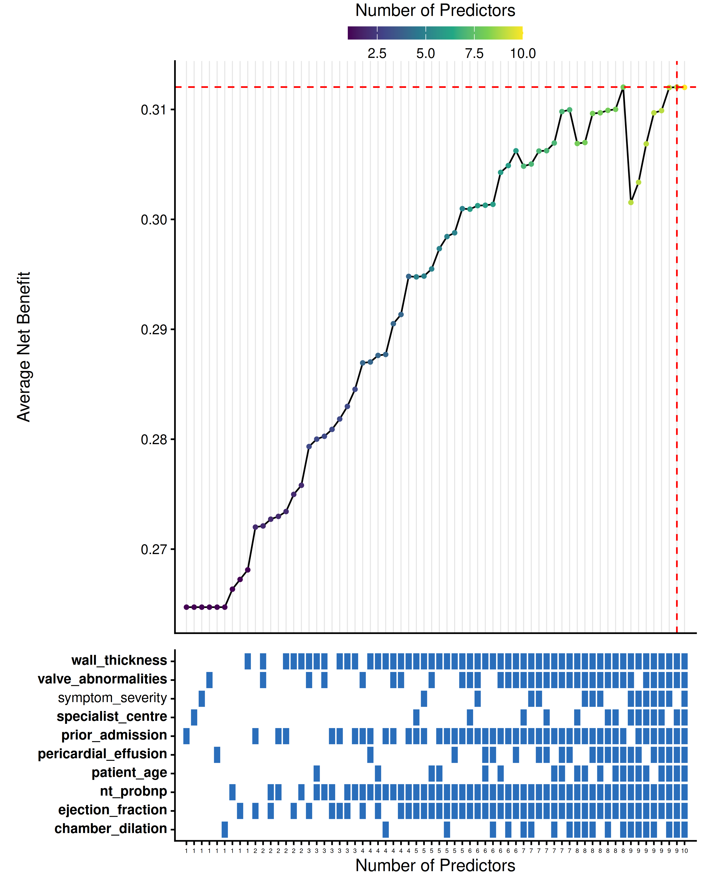

Figure 4: All subset plot (Net Benefit)

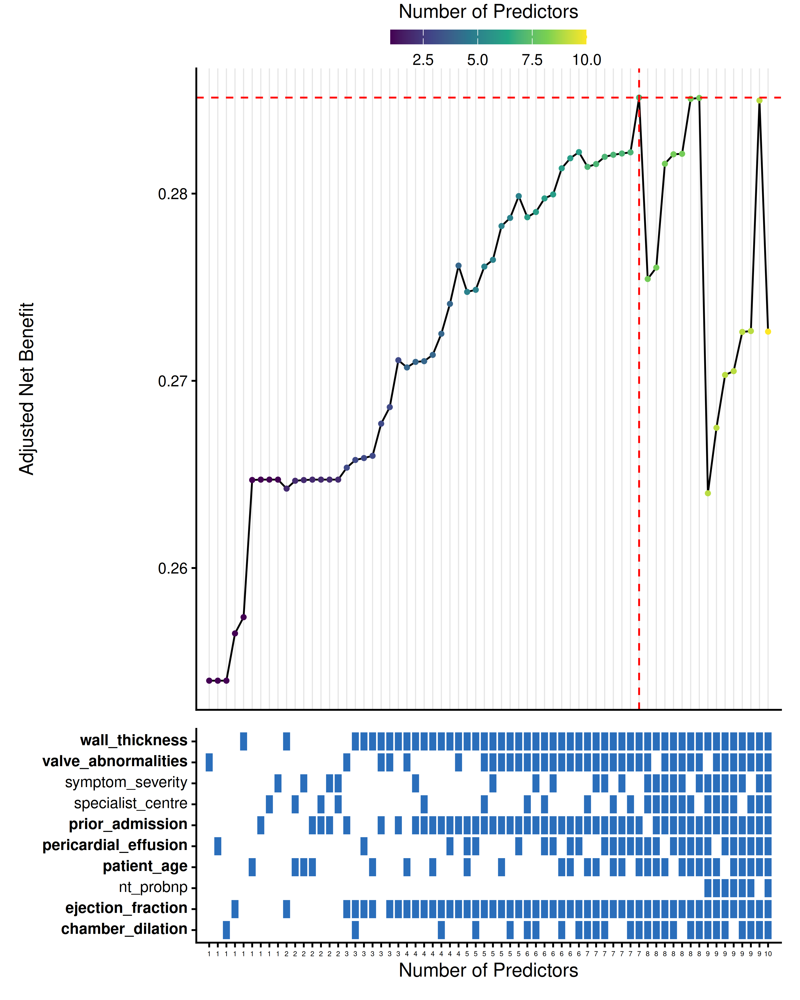

Figure 5: All subset plot (Adjusted Net Benefit)

[Figure 4](#fig-case-subset-1) and [Figure 5](#fig-case-subset-2) show
the all-subset plots. Each point represents a model. The heatmap below
indicates which predictors are included. Note the difference in ranking
when costs are accounted for.

### 3.4 Groupwise net benefit variable selection

Code

``` r
start_time <- Sys.time()
groupwise <- nb_varsel(
  data = training_data,
  outcome_var = "readmitted",
  costs = grouped_costs,
  thresholds = seq(0.01, 0.2, by = 0.01),
  include_interactions = FALSE,
  cv_folds = 5,
  mode = "groupwise",
  allow_parallel = TRUE,
  permutation = TRUE,
  splines = FALSE,
  group_size = 1,
  verbose = TRUE
)
end_time <- Sys.time()
sprintf("Groupwise search took: %s", format(end_time - start_time))
```

    [1] "Groupwise search took: 18.23173 secs"

Code

``` r
groupwise$best_model_stats |>
  select(Model, AUC, Brier, Total_Cost, Avg_Adj_Net_Benefit, Avg_Net_Benefit) |>
  gt() |>
  fmt_number(
    columns = c("AUC", "Brier", "Total_Cost", "Avg_Adj_Net_Benefit", "Avg_Net_Benefit"),
    decimals = 3
  ) |>
  cols_label(
    Model = "Included predictors",
    AUC = "AUC",
    Brier = "Brier Score",
    Avg_Net_Benefit = "Avg. NB",
    Total_Cost = "Total Cost",
    Avg_Adj_Net_Benefit = "Avg. Adj. NB"
  )
```

| Included predictors                                                                                                                             | AUC   | Brier Score | Total Cost | Avg. Adj. NB | Avg. NB |
|-------------------------------------------------------------------------------------------------------------------------------------------------|-------|-------------|------------|--------------|---------|
| patient_age, prior_admission, specialist_centre, ejection_fraction, valve_abnormalities, pericardial_effusion, chamber_dilation, wall_thickness | 0.895 | 0.122       | 0.011      | 0.285        | 0.295   |

Table 4: Groupwise selection: best model

Code

``` r
VIF_plot(groupwise$all_models)
```

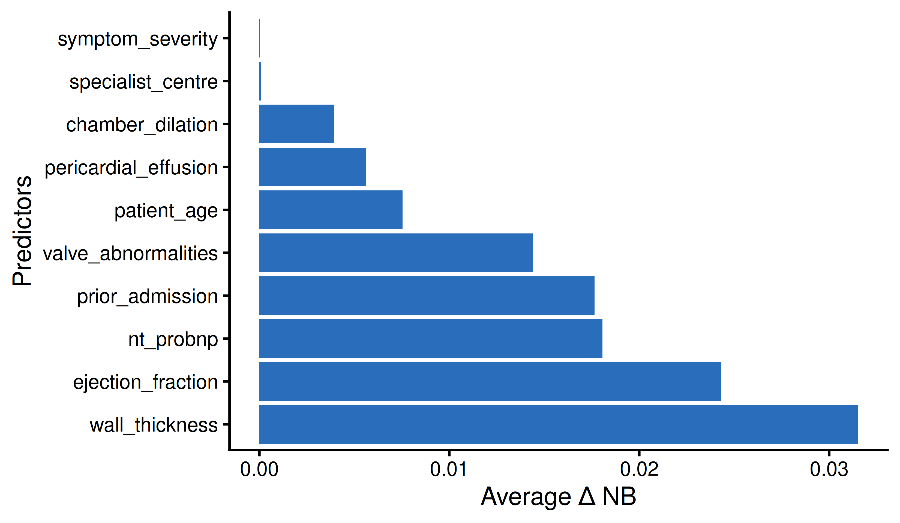

Figure 6: Variable importance (groupwise selection)

### 3.5 Comparison with other methods

We compare the NB-based variable selection with backward elimination
(Wald statistic) and LASSO (L1-penalised logistic regression).

Code

``` r
preds <- setdiff(vars, "readmitted")

# --- Backward elimination ---
fmla_full <- reformulate(termlabels = preds, response = "readmitted")
model_full <- lrm(fmla_full, data = training_data)
bw <- fastbw(model_full)
model_bw <- lrm(
  reformulate(termlabels = bw$names.kept, response = "readmitted"),
  data = training_data
)
test_data$bw_pred <- plogis(predict(model_bw, newdata = test_data))

# --- LASSO ---
x_train <- as.matrix(training_data[, preds])
y_train <- training_data$readmitted
x_test <- as.matrix(test_data[, preds])

set.seed(4738)
cv_lasso <- cv.glmnet(x_train, y_train, alpha = 1, family = "binomial")
lasso_coefs <- coef(cv_lasso, s = "lambda.1se")
lasso_kept <- rownames(lasso_coefs)[as.vector(lasso_coefs != 0)]
lasso_kept <- setdiff(lasso_kept, "(Intercept)")
test_data$lasso_pred <- as.vector(
  plogis(predict(cv_lasso, newx = x_test, s = "lambda.1se"))
)

# --- NB models ---
preds_best_nb <- str_trim(
  str_split(
    all_models |> arrange(-Avg_Net_Benefit) |> slice(1) |> pull(Model),
    ","
  )[[1]]
)
preds_best_adj <- str_trim(
  str_split(exhaustive_results$best_model_stats$Model, ",")[[1]]
)

model_nb <- lrm(
  reformulate(preds_best_nb, "readmitted"),
  data = training_data
)
model_adj_nb <- lrm(
  reformulate(preds_best_adj, "readmitted"),
  data = training_data
)
test_data$nb_pred <- plogis(predict(model_nb, newdata = test_data))
test_data$adj_nb_pred <- plogis(predict(model_adj_nb, newdata = test_data))
```

#### 3.5.1 Selected variables

Code

``` r
sprintf("NB model retains: %s", paste(preds_best_nb, collapse = ", "))
```

    [1] "NB model retains: patient_age, nt_probnp, prior_admission, specialist_centre, ejection_fraction, valve_abnormalities, pericardial_effusion, chamber_dilation, wall_thickness"

Code

``` r
sprintf("Adjusted NB model retains: %s", paste(preds_best_adj, collapse = ", "))
```

    [1] "Adjusted NB model retains: patient_age, prior_admission, ejection_fraction, valve_abnormalities, pericardial_effusion, chamber_dilation, wall_thickness"

Code

``` r
sprintf("Backward elimination retains: %s", paste(bw$names.kept, collapse = ", "))
```

    [1] "Backward elimination retains: patient_age, nt_probnp, prior_admission, ejection_fraction, valve_abnormalities, pericardial_effusion, chamber_dilation, wall_thickness"

Code

``` r
sprintf("LASSO retains: %s", paste(lasso_kept, collapse = ", "))
```

    [1] "LASSO retains: patient_age, nt_probnp, prior_admission, ejection_fraction, valve_abnormalities, pericardial_effusion, chamber_dilation, symptom_severity, wall_thickness"

#### 3.5.2 Discrimination

Code

``` r
auc_results <- data.frame(
  Method = c("NB Model", "Adjusted NB Model", "Backward elimination", "LASSO"),
  AUC = c(
    as.numeric(pROC::auc(test_data$readmitted, test_data$nb_pred)),
    as.numeric(pROC::auc(test_data$readmitted, test_data$adj_nb_pred)),
    as.numeric(pROC::auc(test_data$readmitted, test_data$bw_pred)),
    as.numeric(pROC::auc(test_data$readmitted, test_data$lasso_pred))
  ),
  n_predictors = c(
    length(preds_best_nb),
    length(preds_best_adj),
    length(bw$names.kept),
    length(lasso_kept)
  )
)

auc_results |>
  gt() |>
  fmt_number(columns = "AUC", decimals = 3) |>
  cols_label(n_predictors = "N predictors")
```

| Method               | AUC   | N predictors |
|----------------------|-------|--------------|
| NB Model             | 0.926 | 9            |
| Adjusted NB Model    | 0.890 | 7            |
| Backward elimination | 0.927 | 8            |
| LASSO                | 0.926 | 9            |

Table 5: AUC on test data for each variable selection method

#### 3.5.3 Decision curve analysis

Code

``` r
thresholds <- seq(0.01, 0.30, by = 0.005)
n_test_obs <- nrow(test_data)
y_test <- test_data$readmitted
prev <- mean(y_test)

calc_nb <- function(probs, y, thresholds) {
  n <- length(y)
  vapply(thresholds, function(pt) {
    pred_pos <- probs >= pt
    tp <- sum(y == 1 & pred_pos)
    fp <- sum(y == 0 & pred_pos)
    (tp / n) - (fp / n) * (pt / (1 - pt))
  }, numeric(1))
}

nb_all <- prev - (1 - prev) * (thresholds / (1 - thresholds))

dca_df <- bind_rows(
  data.frame(
    threshold = thresholds,
    net_benefit = calc_nb(test_data$nb_pred, y_test, thresholds),
    label = "NB Model"
  ),
  data.frame(
    threshold = thresholds,
    net_benefit = calc_nb(test_data$adj_nb_pred, y_test, thresholds),
    label = "Adjusted NB Model"
  ),
  data.frame(
    threshold = thresholds,
    net_benefit = calc_nb(test_data$bw_pred, y_test, thresholds),
    label = "Backward elimination"
  ),
  data.frame(
    threshold = thresholds,
    net_benefit = calc_nb(test_data$lasso_pred, y_test, thresholds),
    label = "LASSO"
  ),
  data.frame(
    threshold = thresholds,
    net_benefit = nb_all,
    label = "Treat all"
  ),
  data.frame(
    threshold = thresholds,
    net_benefit = 0,
    label = "Treat none"
  )
)

# Compute costs per method
cost_nb <- NBvarsel:::calculate_model_cost(preds_best_nb, grouped_costs)
cost_adj <- NBvarsel:::calculate_model_cost(preds_best_adj, grouped_costs)
cost_bw <- NBvarsel:::calculate_model_cost(bw$names.kept, grouped_costs)
cost_lasso <- NBvarsel:::calculate_model_cost(lasso_kept, grouped_costs)

dca_df <- dca_df |>
  mutate(
    cost = case_when(
      label == "NB Model" ~ cost_nb,
      label == "Adjusted NB Model" ~ cost_adj,
      label == "Backward elimination" ~ cost_bw,
      label == "LASSO" ~ cost_lasso,
      TRUE ~ 0
    ),
    adj_net_benefit = net_benefit - cost
  )

model_labels <- c(
  "NB Model", "Adjusted NB Model", "Backward elimination",
  "LASSO", "Treat all", "Treat none"
)
dca_df$label <- factor(dca_df$label, levels = model_labels)

# Raw NB
ggplot(dca_df, aes(x = threshold, y = net_benefit, color = label, linetype = label)) +
  geom_line(linewidth = 0.7) +
  theme_classic(base_size = 12) +
  labs(x = "Decision Threshold", y = "Net Benefit", color = "Strategy",
       linetype = "Strategy") +
  coord_cartesian(xlim = c(0, 0.30), ylim = c(-0.01, max(dca_df$net_benefit) * 1.05)) +
  scale_color_manual(values = c(
    "NB Model" = "#0072B5", "Adjusted NB Model" = "#BC3C29",
    "Backward elimination" = "#E18727", "LASSO" = "#20854E",
    "Treat all" = "black", "Treat none" = "black"
  )) +
  scale_linetype_manual(values = c(
    "NB Model" = "solid", "Adjusted NB Model" = "solid",
    "Backward elimination" = "solid", "LASSO" = "solid",
    "Treat all" = "dashed", "Treat none" = "dotted"
  ))

# Adjusted NB
ggplot(dca_df, aes(x = threshold, y = adj_net_benefit, color = label, linetype = label)) +
  geom_line(linewidth = 0.7) +
  theme_classic(base_size = 12) +
  labs(
    x = "Decision Threshold",
    y = "Harm-adjusted Net Benefit",
    color = "Strategy",
    linetype = "Strategy"
  ) +
  coord_cartesian(xlim = c(0, 0.30), ylim = c(-0.01, max(dca_df$adj_net_benefit) * 1.05)) +
  scale_color_manual(values = c(
    "NB Model" = "#0072B5", "Adjusted NB Model" = "#BC3C29",
    "Backward elimination" = "#E18727", "LASSO" = "#20854E",
    "Treat all" = "black", "Treat none" = "black"
  )) +
  scale_linetype_manual(values = c(
    "NB Model" = "solid", "Adjusted NB Model" = "solid",
    "Backward elimination" = "solid", "LASSO" = "solid",
    "Treat all" = "dashed", "Treat none" = "dotted"
  ))
```

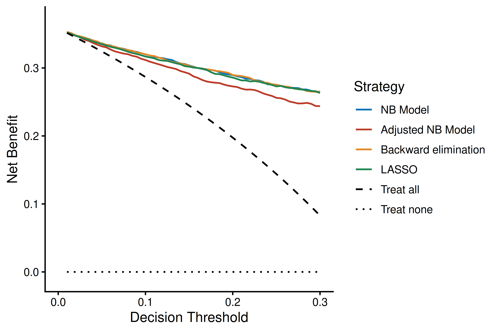

Figure 7: Decision curve analysis comparing net benefit across methods.

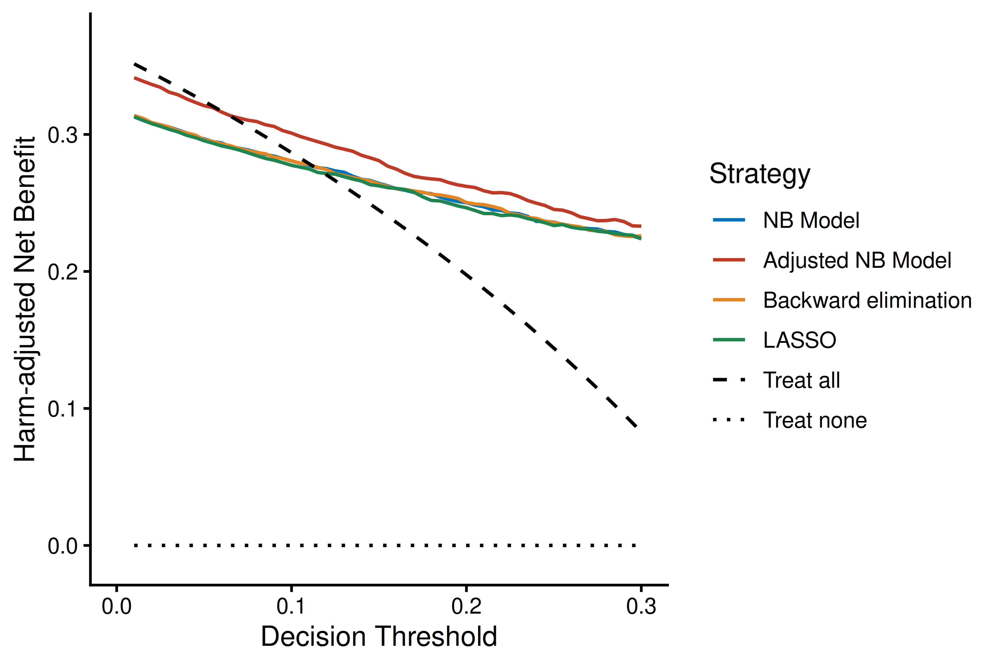

Figure 8: Decision curve analysis comparing harm-adjusted net benefit.

[Figure 7](#fig-dca-1) shows the standard decision curve analysis.
[Figure 8](#fig-dca-2) shows the same curves after subtracting each
method’s test costs, highlighting the advantage of cost-aware variable
selection.

## 4 Case study — ADNEX ovarian tumour data

> **Pre-computed results**
>
> The original patient-level data from the IOTA consortium are not
> publicly available. This section uses pre-computed results shipped
> with the package (`adnex_results`). The analysis code is shown for
> transparency but is not executed.

This section demonstrates the methodology on real clinical data used to
develop the ADNEX model for classifying ovarian tumours as benign or
malignant. The data come from the International Ovarian Tumour Analysis
(IOTA) consortium, phases 1–3, and comprise 16 candidate predictors.

### 4.1 Predictors and cost structure

Predictors are grouped into three cost categories reflecting the
clinical workflow:

- **Clinical history** (no cost): patient age, family history of ovarian
  cancer, oncology centre, pain
- **Ultrasound examination** (moderate cost): maximum lesion diameter,
  proportion solid, locules \> 10, papillary count, papillary presence,
  acoustic shadows, ascites, irregular walls, bilateral, colour score,
  maximum solid diameter
- **Blood biomarker** (higher cost): CA-125

Code

``` r
vars <- c(
  "malignant", "age", "ca125", "family_history", "locules_gt_10",
  "oncology_center", "max_diam_lesion", "papillary_count",
  "acoustic_shadows", "ascites", "ireg_walls", "bilateral",
  "color_score", "pain", "max_diam_solid", "papillary_presence",
  "prop_solid"
)

prevalence <- mean(test_data$malignant)

grouped_costs <- list(
  history = list(
    cost = 0,
    vars = c("age", "family_history", "oncology_center", "pain")
  ),
  US = list(
    cost = prevalence * 0.02,
    vars = c(
      "max_diam_lesion", "prop_solid", "locules_gt_10",
      "papillary_count", "acoustic_shadows", "ascites",
      "bilateral", "ireg_walls", "papillary_presence",
      "color_score", "max_diam_solid"
    )
  ),
  blood = list(
    cost = prevalence * 0.05,
    vars = c("ca125")
  )
)
```

### 4.2 Exhaustive search

The exhaustive search evaluated all 65,535 (2^16 - 1) predictor
combinations using 20-fold cross-validation with restricted cubic
splines (3 knots) and permutation importance.

Code

``` r
exhaustive_results <- nb_varsel(
  data = training_data[, vars],
  outcome_var = "malignant",
  costs = grouped_costs,
  thresholds = seq(0.01, 0.2, by = 0.01),
  include_interactions = FALSE,
  cv_folds = 20,
  mode = "exhaustive",
  allow_parallel = TRUE,
  permutation = TRUE,
  splines = TRUE
)
```

The pre-computed results are available as a shipped dataset:

Code

``` r
data(adnex_results)
```

#### 4.2.1 Best model

Code

``` r
best <- attr(adnex_results, "best_model_stats")

best |>
  select(Model, n_Preds, AUC, Brier, Total_Cost,
         Avg_Adj_Net_Benefit, Avg_Net_Benefit) |>
  gt() |>
  fmt_number(
    columns = c("AUC", "Brier", "Total_Cost",
                "Avg_Adj_Net_Benefit", "Avg_Net_Benefit"),
    decimals = 3
  ) |>
  cols_label(
    Model = "Included predictors",
    n_Preds = "N",
    AUC = "AUC",
    Brier = "Brier Score",
    Avg_Net_Benefit = "Avg. NB",
    Total_Cost = "Total Cost",
    Avg_Adj_Net_Benefit = "Avg. Adj. NB"
  )
```

| Included predictors                                                                                                                                                        | N   | AUC   | Brier Score | Total Cost | Avg. Adj. NB | Avg. NB |
|----------------------------------------------------------------------------------------------------------------------------------------------------------------------------|-----|-------|-------------|------------|--------------|---------|
| age, locules_gt_10, oncology_center, max_diam_lesion, papillary_count, acoustic_shadows, ascites, ireg_walls, bilateral, color_score, pain, papillary_presence, prop_solid | 13  | 0.952 | 0.080       | 0.005      | 0.290        | 0.295   |

Table 6: Best model from the ADNEX exhaustive search (ranked by
cost-adjusted Net Benefit)

The best model retains 13 of the 16 predictors, excluding CA-125, family
history, and maximum solid diameter. Despite using fewer predictors, the
cost-adjusted Net Benefit is maximised because the excluded predictors
contributed little utility relative to their cost.

#### 4.2.2 Top models

Code

``` r
adnex_results$Rank_adj_NB <- rank(
  -adnex_results$Avg_Adj_Net_Benefit, ties.method = "min"
)

tbl_data <- adnex_results |>
  select(Rank_adj_NB, Model, n_Preds, AUC, Brier,
         Total_Cost, Avg_Adj_Net_Benefit, Avg_Net_Benefit)

tbl <- tbl_data |>
  gt() |>
  fmt_number(
    columns = c("AUC", "Brier", "Total_Cost",
                "Avg_Adj_Net_Benefit", "Avg_Net_Benefit"),
    decimals = 3
  ) |>
  cols_label(
    Rank_adj_NB = "Rank (Adj. NB)",
    Model = "Included predictors",
    n_Preds = "N",
    AUC = "AUC",
    Brier = "Brier Score",
    Avg_Net_Benefit = "Avg. NB",
    Total_Cost = "Total Cost",
    Avg_Adj_Net_Benefit = "Avg. Adj. NB"
  )

if (knitr::is_html_output()) {
  tbl <- tbl |>
    opt_interactive(
      use_pagination = TRUE,
      page_size_default = 10,
      use_filters = TRUE,
      use_compact_mode = TRUE
    )
}
tbl
```

Table 7: Top models per predictor count from the ADNEX exhaustive search

#### 4.2.3 Visualisation

Code

``` r
VIF_plot(adnex_results)
```

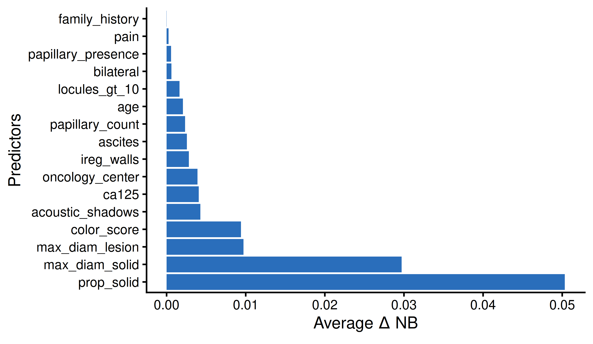

Figure 9: Variable importance for the ADNEX case study. Bars show the
average drop in Net Benefit when each predictor is permuted.

[Figure 9](#fig-adnex-vif) shows that the proportion solid component and
colour score are the most important predictors for clinical utility,
followed by maximum lesion diameter and oncology centre status.

Code

``` r
all_subset_plot(
  adnex_results,
  filter = 7,
  size_dot = 1
)

all_subset_plot(
  adnex_results,
  filter = 7,
  size_dot = 1,
  metric = "Avg_Adj_Net_Benefit",
  y_axis = "Adjusted Net Benefit"
)
```

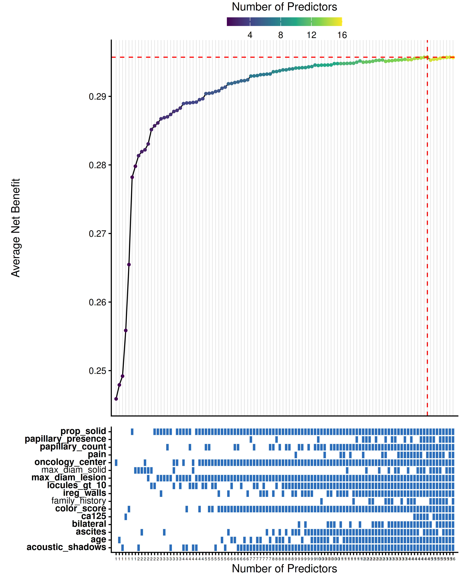

Figure 10: All subset plot (Net Benefit) for the ADNEX case study.

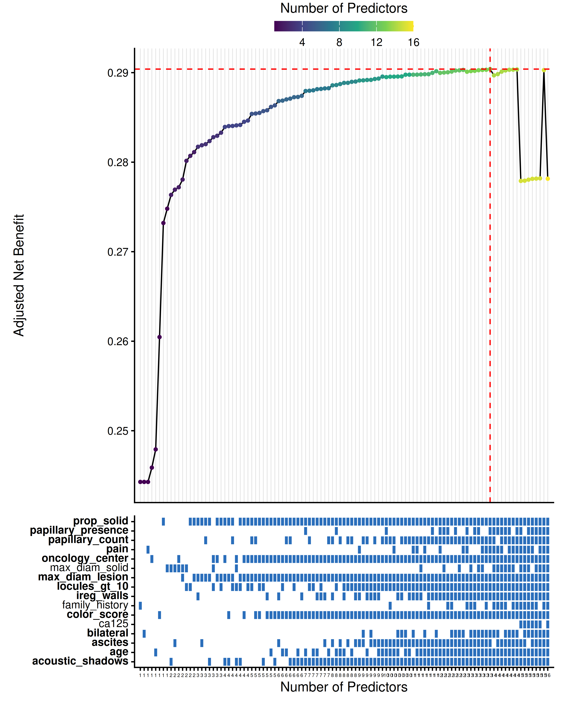

Figure 11: All subset plot (cost-adjusted Net Benefit) for the ADNEX
case study.

[Figure 10](#fig-adnex-subset-1) and [Figure 11](#fig-adnex-subset-2)
show the all-subset plots. The heatmap indicates which predictors are
included in each model. The best model’s predictors are highlighted in
bold. Note that cost adjustment changes the ranking: models that include
the blood biomarker (CA-125) are penalised, shifting the optimum toward
models relying on ultrasound and clinical history alone.

## 5 Summary

This vignette demonstrated the `NBvarsel` workflow:

1.  **[`nb_varsel()`](https://lasaibarrenada.github.io/NB_varsel/reference/nb_varsel.md)**
    identifies optimal predictor subsets by maximising cross-validated
    Net Benefit, optionally adjusted for test costs.
2.  **[`VIF_plot()`](https://lasaibarrenada.github.io/NB_varsel/reference/VIF_plot.md)**
    visualises permutation-based variable importance.
3.  **[`all_subset_plot()`](https://lasaibarrenada.github.io/NB_varsel/reference/all_subset_plot.md)**
    provides a comprehensive view of model performance and predictor
    inclusion across all evaluated combinations.
4.  External validation of selected models can be performed using
    standard discrimination metrics such as AUC.

The key insight is that the statistically best-performing model may not
be the most clinically useful when predictor costs are taken into
account. Cost-aware variable selection via Net Benefit can lead to
simpler, cheaper models that maintain or improve clinical utility.
